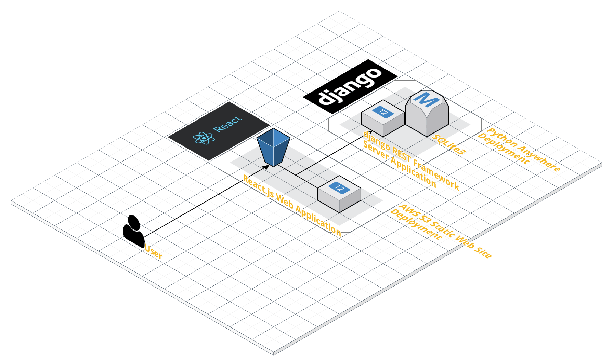

# Summer Coding 2019 Web Project<br/><small>Web With React.js</small>

프로그래머스 주최 2019 썸머코딩 2차 과제 Web 파트 구현물.

주제 : TODO Application 만들기

## Implement Check

- 기능 요구사항
  - [x] 새로운 TODO(제목과 내용)를 작성할 수 있다.
  - [x] TODO 목록을 볼 수 있다.
  - [x] TODO 항목의 제목과 내용을 수정할 수 있다.
  - [x] TODO 항목을 삭제할 수 있다.
  - [x] 사용자의 선택에 의해 TODO에는 마감 기한을 넣을 수 있다.
  - [x] TODO 항목의 우선순위를 설정 및 조절할 수 있다.
  - [x] TODO 항목에 대한 완료 처리를 할 수 있다.
  - [x] 마감기한이 지난 TODO에 대해 알림을 노출할 수 있다.
- 성능 요구사항
  - [x] TODO 이용 시 발생하는 오류 사항을 최소화한다.
  - [x] 오류 발생 시 사용자가 이해하기 쉽게 표시한다.
  - [x] 다른 사람이 읽기 쉬운 코드를 작성한다.
  - [x] HTML/CSS에서 사용할 수 있는 최신 구조와 기술을 사용한다.
- 인터페이스 요구사항
  - [x] 직관적이고 의미 전달이 명확한 화면을 사용자에게 제공한다.

## Develop Stack

- React.js - JavaScript SPA Library
- Axios - AJAX Request
- AWS S3
- Foundation CSS

순수 React.js 만 사용해서 기능들을 구현했습니다.

또한 HTML, CSS 를 자체적으로 사용하는데 집중했습니다.

## NPM Libraries

npm Dependencies 는 다음과 같은 라이브러리가 들어 있습니다.

그래서 첫 실행 시 터미널 창에 `npm init` 문장을 실행 해 주세요.

```
"dependencies": {
    "axios": "^0.18.0",
    "moment": "^2.24.0",
    "react": "^16.8.6",
    "react-dom": "^16.8.6",
    "react-scripts": "3.0.1",
    "simple-react-validator": "^1.0.7"
}
```

## Develop Environment

이 프로젝트는 다음과 같은 환경에서 제작 되었습니다.

- 운영체제 : Windows 10
- IDE : Visual Studio Code

## Deploy Environment



배포 환경은 AWS S3 정적 웹페이지를 사용하였습니다.

그리고 서버는 Spring Boot (AWS Elastic Beanstalk 에 저장된 Tomcat WAR 파일) 와 접속 되어 있습니다.

## Execute This Project

- Linux 를 기준 실행 방법은 다음과 같습니다.
- 기본 실행 port 는 3000 입니다.
- 기본 실행 host 는 127.0.0.1(localhost) 입니다.

1. node.js 를 설치합니다. 설치 이후에 버전이 5.2 이상 인지 확인 하시길 바랍니다.
```
sudo apt-get install -y nodejs
```

2. 이 git 을 clone 한 후에 winter_coding_todo_web 패키지를 생성하기 위하여 `npm init` 로 의존성 library 를 같이 포함 시켜 줍니다.
```
sudo npm init
```

3. 그리고 winter_coding_wodo_web 패키지의 맨 처음 주소를 들어가 다음과 같은 명령어로 실행하실 수 있습니다.

```
sudo npm run start
```

4. 배포는 3번 위치에서 그대로 다음과 같이 입력하시길 바랍니다.

```
sudo npm run build
```

5. 프로젝트 중단을 원하면 터미널 창에서 Ctrl + C 를 입력하시길 바랍니다.

## Server Side References

서버는 django REST Framework 를 이용해서 연동하였습니다.

[참고하러 가기](https://github.com/tails5555/summer2019_todo_server)

## Author

- 강인성([tails5555](https://github.com/tails5555))